<h2 align="center">
    <samp>&gt; HelloWorld(), I am <b><a target="_blank" href="https://zerofour04.me">Ben // Zerofour // 04</a></b></samp>
    
</h2>

<!-- Terminal Section -->

<h3><code>zerofour04@github ~ $ whoami</code></h3>
<table>
  <tr>
    <td valign="top"></td>
    <td valign="top"></td>
  </tr>
</table>

 

<h3><code>zerofour04@github ~ $ ./contributions.sh</code></h3>

 

<h2 align="center">
  <samp>
    「 <b>How to Support me</b> 」
  </samp>
</h2>

  <samp>
    <b>If you enjoy my open-source projects, consider supporting by:</b>
     
     - Starring the repositories you like
     
     - Following my profile for updates
     
     - Sharing the projects with others
  </samp>

  
    
  

|  **Thanks to everyone who's shown their support:**  |
|:---:|
|   |

  
   
  

<h2 align="center">
  <samp>
    「 <b>Working with these languages</b> 」
  </samp>
</h2>

  
  
  
  
  
  
  
  
  
  
  
  

<h3 align="center">Frameworks & Libraries</h3>

  
  
  
  
  

<h3 align="center">Tools</h3>

  
  
  
  
  
  
  
  
  
  
  
  
  
  
  
  
  
  
  
  

  

  

 

<h2 align="center">
  <samp>
    「 <b>Music APIs</b> 」
  </samp>
   
  
</h2>

#### Last played

| Now Playing |
|:---:|
|  |

<table>
  <thead>
    <tr>
      <th>Top Tracks</th>
    </tr>
  </thead>
  <tbody>
    <tr>
      <td></td>
    </tr>
    <tr></tr>
    <tr>
      <td></td>
    </tr>
    <tr></tr>
    <tr>
      <td></td>
    </tr>
  </tbody>
</table>
